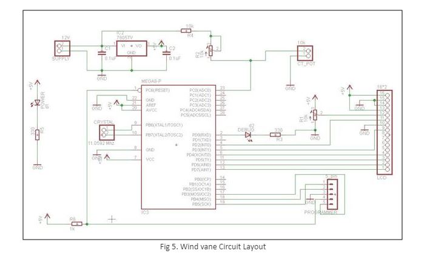

### Procedure
**Introduction:**

The instrumental measurement of wind direction is done by means of a wind vane. Fundamentally wind vane is a body mounted undiametrically about a vertical axis, in which it is free to run. The end of offering the greatest resistance to the motion of the air goes to lee-ward.
The design of a wind vane is such that the weight is evenly distributed on each side of the surface, but the surface area is unequally divided, so that the pointer can move freely on its axis. The side with the larger surface area is blown away from the wind direction, so that the smaller side, with the pointer, is pivoted to face the wind direction. Most wind vanes have directional markers beneath the arrow, aligned with the geographic directions.
Wind vanes, especially those with fanciful shapes, do not always show the real direction of a very gentle wind. This is because the figures do not achieve the necessary design balance: an unequal surface area but balanced in weight.
To obtain an accurate reading, the wind vane must be located well above the ground and away from buildings, trees, and other objects which interfere with the true wind direction. Changing wind direction can be meaningful when coordinated with other apparent sky conditions; enabling the user to make simple short range forecasts From the street level the size of many weathercocks is deceptive

**A] Mechanical Structure:**

**Step-1**

Basic idea to design wind vane, schematic of wind vane shown in following figure 1.

**Step-2**

Support structure for Shaft, potentiometer and bearing fabricated on Epilog Laser cutting machine and then assembled. Complete support structure is shown in fig.2

**Step-3**

For Wind vane Support structure the 2D profiles are drawn and converted into .svg or .odg these are vector graphics format which is used for cutting on Laser cutter machine.

**B] Electronics Circuit:**

Why Electronics Circuit for Wind Vane:
The arrow head points to the direction initially, adjusted to North direction (using magnetic compass) at this position couple the shaft to the servo potentiometer so that resistance of the potentiometer is 0Ω .This is given to the voltage divider circuit this gives an output voltage which is fed to ADC0 of ATmega8. This displays 00 North on LCD display screen.
Then Placed the wind vane structure outdoor as the wind blows the arrow head points the direction of wind & then the corresponding changes in resistance of servo potentiometer cause changes in output voltage of voltage divider, This change in voltage is fed to ADC0 (Analog to Digital Convertor ) pin of AT mega 8 microcontroller. ADC0 (Analog to digital convertor) converts the analog signal into digital form and then these signal is calibrated into readable digital data which is angle in degrees with respect to magnetic north displays on LCD display.

To convert analog signal to digital form an electronic circuit is needed. This circuit consists of At mega 8, regulator IC, Servo pot,LCD display.

**Step-4**

Electronics Circuit layout designed shown in following fig 5.

**Step-5**

List of component as given below.

**Advantages:**

Using Electronics circuit to get better accuracy, linearity and less noise.
* Accuracy: At mega 8 has inbuilt. 10 bit ADC. Gives better accuracy over mechanical devices
* Linearity: The change in output per degree rotation of the servo Potentiometer is linear.
* Less noise: there is less noise in A to D conversion, due to which stable output is obtained without any fluctuations.
* Can be interfaced with LCD or computer using serial communication.
* Compact in size and highly reliable.

**Step-6**

Convert Wind Vane Circuit Layout into Board file.

**Step-7**

Remove display from the toolbox as Shown in following fig 7.

**Step-8**

Go to file à Export à Image à save file with .png extension, Select Monochrome and Resolution: 500

**Step-9**

After removing the layers of display Final Board file will be as shown in following figure 8.Invert the image.

**Step-10**
Refer exp.3 for PCB milling

**Step-11**
After finishing PCB milling mount required components on board,

**Step-12**
Solder components on PCB on appropriate location as Shown in Fig 12.

**Fabrication of PCB**

**Step-13**

Connect 12 v power supply, and wind vane 10 k potentiometer to the circuit. Upload program on ATmega8 (Refer Exp.4 for Interface Programming)

Testing: Connect Power supply and Potentiometer (Servo pot) to the circuit.

**Testing Stages:**
* Check For short circuit
* Power On the 12 volt supply
* LED and LCD will glow brightly means power supply is correct.
* Check LCD (16*2) Display is glowing or not??? If Not, Check Circuit to adjust brightness of the LCD by adjusting 10k vertical pot.
* Adjust other 10k Potentiometer for linear voltage change of 0-5 Voltage for 3600 rotation; adjust 0 Voltage for North direction.
* Rotate arrow manually and check direction and angle in LCD display is correct.

**Circuit Working:**

* The wind vane consist of a servo Potentiometer (0-10K)
* It is connected with a 10K Potentiometer in a voltage divider circuit with 10k fix and 10k Potentiometer in series resistance and 12 Voltage supply.
* The resistance of the Potentiometer is so adjusted that there is a linear voltage change of 0-5V for 360 degrees rotation of the servo pot.
* Wind vane pointing 0 degree i.e. north voltage output of the voltage divider is adjusted to 0V.
* On 0-360 degree rotation of the servo Potentiometer there is linear change in output of the voltage divider circuit.
* The output is fed to ADC0 pin of the ATmega 8.
* LCD is interfaced to port D of the atmega8 with 4 bit control mode.
* Flow chart or algorithm of the A to D conversion as follows

**Algorithm running on controller attached to wind vane:**
1. Start
2. Initiate LCDS screen
3. Initiate ADC
4. Wait for ADC conversion to complete
5. Start ADC converted value into a variable ADC value
6. Calculate the signal value with the formula
	Signal Value = ADC-value/1024*57)
7. Calculate the resistance using formula
	Calculated resistance= Signal value *14/12-signal value8)
8. Calculate the corresponding angle by
	Calculated angle= Calculated resistance * 3600 /109)
9. Display angle and direction on LCD as per calculated angle.
10. Go to Step 3
11. Stop.

**Step 14:** Vector profile cutting for Circuit casing box using laser cutter

