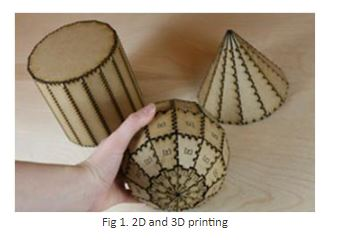
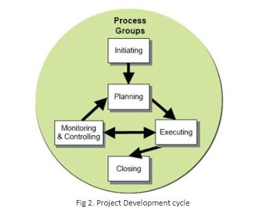

### Theory

**What is Digital Fabrication?**

Digital fabrication is the process of translating a digital design developed on a computer into a physical object. Neil Gershenfeld (2005) popularized this concept through Fabrication Laboratories at M.I.T. A Fabrication Lab is a centre that allows individuals to design and make (almost) anything.
Personal fabrication systems that are the microcomputer equivalent of MIT's Fabrication Laboratories are now emerging. The next generation of personal digital fabricators now Make digital fabrication in schools feasible and practical for the first time (Bull & Groves, 2009). Low cost, versatility, and ease of use make this technology accessible to Educators and students and can facilitate the introduction of engineering design and manufacturing concepts into early education.

**Step-By-Step Model Making**
1. Design Your Project.
2. Construction Method.
3. Break Design into flat planes
4. Place Component Surfaces on the one Cutting Plane
6. Label the Components
7. Nesting
8. Cut it in Fab Lab using cutting tools
9. Build your model from the cut components

Digital fabrication is a new kind of industry that uses computer-controlled tools to turn digital designs into useful physical objects.
Examples of digital fabrication technologies include the Multi-machine - an open-source mill-drill-lathe. Combined with computer numerical control (CNC) of the work piece table, it becomes a digital fabrication device capable of making metal pieces of any arbitrary shape from forks to fenders and from ball bearings to Bunsen burners. The only limit being human creativity and the designs available in the Open Hardware Repository.
The aim of the Open Ecology movement is to catalyse the new digital industrial revolution and help create what we call Industry 2.0. This certainly has implications that no one has anticipated, but some characteristics are apparent -

**Characteristics:**

**Digital fabrication is flexible**

This allows for one machine to fulfil many roles and reduces space and resources. Industrial mass-production required a different factory for every type of product, but flexible, digital manufacturing allows the same set of tools to be use to make any electromechanical device you care to name. Flexibility makes it worthwhile to invest in your own fabrication tools; only industrialists would invest in a tool that makes the same thing over and over again, but a tool that can respond to one's needs is a tool worth having in your home.

**Digital fabrication is decentralized**

It is no longer necessary to have large factories where technology is made before being distributed around the world. Instead, technologies can be made locally. Essentially, the products travel most of their journey at light-speed as digitally stored data. Design is global; instantiation is local.

**Digital fabrication is cheap**

Once a person has fabrication machines, they can create a car, a mobile phone, agricultural equipment or whatever at the cost of raw materials. The standard industrial supply-chain greatly inflates the price of manufactured goods. If you buy a commercially-manufactured computer, your dollar has to cover the costs of mining the material, shipping the material to China, running the machines, labour, marketing, more shipping, and mark-ups by several retailers. Digital fabrication, by empowering people to manufacture their own wealth in their backyard, cuts out all those extra costs and reduces the cost to just energy plus information plus raw materials. Energy comes free from the sun and information comes free from the Internet, so the only cost is raw materials.

**Digital fabrication is customizable**

The Web is revolutionizing media and information services because of the ease with which users can generate their own content. The old media (TV, newspapers, radio etc.) were generally one-way channels that made it easy to be a consumer of information and difficult to become a producer. But with blogs, out-of-the-box websites, wikis and so forth, anyone can now broadcast information. Digital manufacturing represents the same revolution of user-generated content being brought to physical goods like electronics. With digital manufacturing, everyone can generate their own phone, their own computer, their own mp3 player or alarm clock. They can express their creativity in their products, rather than having to buy mass-produced ones.

**Digital fabrication empowers the poor**

Housing, medical equipment, agricultural equipment, electronics - let's assume that it would be a good thing to provide poor people with these things. How are we to do it? You could say there are two ways: One is to manufacture the goods in wealthier places and ship them over and the other is to manufacture them on-site where they are needed. Of these two solutions, only the second one creates local economic stimulus, teaches technological skills and makes communities economically self-sufficient.

**Digital fabrication is evolving**

The ultimate fruit of digital fabrication will be the Molecular assembler that rearranges atoms and puts them in place at great speed to build absolutely anything, including nanoscale robots and ham sandwiches. The current generation is a Fab Lab, a workshop of about 14 tools costing about $50,000 that can build nearly any electromechanical device. One of the core projects of the Open Ecology movement is to create the RepLab, a second-generation Fab Lab that uses only open-source hardware, is self-replicating (one RepLab can be used to build another) and costs only a fraction of what first-generation Fab Labs cost.
Digital fabrication is based on having a digital (computer) model of something you want made and then using a digital fabrication tool to make it (digital model > digital production). Digital models are amazing to work with because they allow you to share the exact details of something you would like made with a shop up the street or on the other side of the world. Once given a digital model, a digital fabrication tool can reproduce it reliably and in high fidelity, whether you want one piece or a thousand.

**Digital Fabrication**

FAB LAB offers multiple ways to explore digital fabrication. Development of your ideas, Own design and fabricate using fab lab tools,
WOOD CUTTING, LASER CUTTING, LASER ENGRAVING/ETCHING,
VINYL LETTERING AND ARTWORK, 3D PRINTING AND MILLING

Applications: Among many possibilities these are some of the fields where digital fabrication services applied: Toys, Architecture Models, Jewellery, Products Displays, Awards and trophies, Furniture Design, Lamps & Lighting Design, Wood Craft, Signage, Packaging, Circuit Boards Print, Arts and Crafts, Prototyping, Ornaments, Personalized Gifts, Stationery and Greetings Cards, and anything else your imagination would like to create!
Take a look at some of the projects made in FAB LAB COEP and learn how to use this creative FAB LAB fabrication tools in the FAB LAB Network

**MACHINES FOR FABRICATION**

**CNC router**

CNC stands for computer numerical control. Through a computer controller, G-codes are read which represent specific CNC functions in alphanumeric format. The g-codes drive a machine tool, a powered mechanical device typically used to fabricate components. CNC machines are classified according to the number of axes that they possess. CNC machines are specifically successful in milling materials such as plywood, foam board, and steel at a fast speed. CNC machine beds are typically large enough to allow 4' x 8' (123 cm x 246 cm) sheets of ¾” (19mm) thick plywood to be cut.

**Laser Cutter**

The laser cutter is a machine that uses a laser to cut materials such as chip board, matte board, thin sheets of wood, acrylic up to 3/8" (1 cm) thickness. AutoCAD is used in the production of lines on a grid, which would be sent to the laser cutter as a .dwg file. Lines can either cut through the material or score it depending on the colour of the line drawn. Lines drawn in white will be cut and lines in red will score the material in the cutting bed. Objects cut out of materials can be used in the fabrication of physical models, which will only require the piecing together of the parts.

**Digital fabrication techniques**

Digital fabrication techniques have been used for biomedical applications, as well as to produce MEMS and new electronic devices. Conference topics include 2D & 3D functional printing and micromachining as shown in fig 1.

**Project Development cycle**

Traditionally, project management includes a number of elements: four to five process groups, and a control system. Regardless of the methodology or terminology used, the same basic project management processes will be used. Major process groups generally include:
* Initiation
* planning or development
* production or execution
* monitoring and controlling
* closing

In project environments with a significant exploratory element (e.g., research and development), these stages may be supplemented with decision points (go/no go decisions) at which the project's continuation is debated and decided. An example is the stage-gate model.

**Initiating**

The initiating processes determine the nature and scope of the project.If this stage is not performed well, it is unlikely that the project will be successful in meeting the business' needs. The key project controls needed here are an understanding of the business environment and making sure that all necessary controls are incorporated into the project. Any deficiencies should be reported and a recommendation should be made to fix them.
The initiating stage should include a plan that encompasses the following areas:
* analysing the business needs/requirements in measurable goals
* reviewing of the current operations
* financial analysis of the costs and benefits including a budget
* stakeholder analysis, including users, and support personnel for the project
* project charter including costs, tasks, deliverables, and schedule

**Planning and design**

After the initiation stage, the project is planned to an appropriate level of detail, the main purpose is to plan time, cost and resources adequately to estimate the work needed and to effectively manage risk during project execution. As with the Initiation process group, a failure to adequately plan greatly reduces the project's chances of successfully accomplishing its goals.

* Project planning generally consists of determining how to plan (e.g. by level of detail or rolling wave);
* developing the scope statement;
* selecting the planning team;
* identifying deliverables and creating the work breakdown structure;
* identifying the activities needed to complete those deliverables and networking the activities in their logical sequence;
* estimating the resource requirements for the activities;
* estimating time and cost for activities;
* developing the schedule;
* developing the budget;
* risk planning;
* Gaining formal approval to begin work.

additional processes, such as planning for communications and for scope management, identifying roles and responsibilities, determining what to purchase for the project and holding a kick-off meeting are also generally advisable.
For new product development projects, conceptual design of the operation of the final product may be performed concurrent with the project planning activities, and may help to inform the planning team when identifying deliverables and planning activities.

**Executing**

Executing consists of the processes used to complete the work defined in the project plan to accomplish the project's requirements. Execution process involves coordinating people and resources, as well as integrating and performing the activities of the project in accordance with the project management plan. The deliverables are produced as outputs from the processes performed as defined in the project management plan and other frameworks that might be applicable to the type of project at hand.

**Monitoring and controlling**

Monitoring and controlling consists of those processes performed to observe project execution so that potential problems can be identified in a timely manner and corrective action can be taken, when necessary, to control the execution of the project. The key benefit is that project performance is observed and measured regularly to identify variances from the project management plan.

Monitoring and controlling includes: Measuring the ongoing project activities ('where we are');

* Monitoring the project variables (cost, effort, scope, etc.) against the project management plan and the project performance baseline (where we should be);
* Identify corrective actions to address issues and risks properly (How can we get on track again);
* Influencing the factors that could circumvent integrated change control so only approved changes are implemented.
* In multi-phase projects, the monitoring and control process also provides feedback between project phases, in order to implement corrective or preventive actions to bring the-project into compliance with the project management plan.
* Project maintenance is an ongoing process, and it includes: Continuing support of end-users
* Correction of errors
* Updates of the software over time
* Monitoring and controlling cycle

In this stage, auditors should pay attention to how effectively and quickly user problems are resolved.
Over the course of any construction project, the work scope may change. Change is a normal and expected part of the construction process. Changes can be the result of necessary design modifications, differing site conditions, material availability, contractor-requested changes, value engineering and impacts from third parties, to name a few. Beyond executing the change in the field, the change normally needs to be documented to show what was actually constructed. This is referred to as change management. Hence, the owner usually requires a final record to show all changes or, more specifically, any change that modifies the tangible portions of the finished work. The record is made on the contract documents – usually, but not necessarily limited to, the design drawings. The end product of this effort is what the industry terms as-built drawings, or more simply, “as built.” The requirement for providing them is a norm in construction contracts.
When changes are introduced to the project, the viability of the project has to be re-assessed. It is important not to lose sight of the initial goals and targets of the projects. When the changes accumulate, the forecasted result may not justify the original proposed investment in the project.

**Closing**

Closing includes the formal acceptance of the project and the ending thereof. Administrative activities include the archiving of the files and documenting lessons learned.

**Project close:** Finalize all activities across all of the process groups to formally close the project or a project phase
Contract closure: Complete and settle each contract (including the resolution of any open items) and close each contract applicable to the project or project phase.

**Project controlling and project control systems**

Project controlling should be established as an independent function in project management. It implements verification and controlling function during the processing of a project in order to reinforce the defined performance and formal goals. The tasks of project controlling are also:
* the creation of infrastructure for the supply of the right information and its update
* the establishment of a way to communicate disparities of project parameters
* the development of project information technology based on an intranet or the determination of a project key performance index system (KPI)
* divergence analyses and generation of proposals for potential project regulations
* the establishment of methods to accomplish an appropriate the project structure, project workflow organization, project control and governance
* creation of transparency among the project parameters

Fulfilment and implementation of these tasks can be achieved by applying specific methods and instruments of project controlling.The following methods of project controlling can be applied:
* investment analysis
* cost–benefit analyses
* value benefit Analysis
* expert surveys
* simulation calculations
* risk-profile analyses
* surcharge calculations
* milestone trend analysis
* cost trend analysis
* target/actual-comparison

Project control is that element of a project that keeps it on-track, on-time and within budget. Project control begins early in the project with planning and ends late in the project with post-implementation review, having a thorough involvement of each step in the process. Each project should be assessed for the appropriate level of control needed: too much control is too time consuming, too little control is very risky. If project control is not implemented correctly, the cost to the business should be clarified in terms of errors, fixes, and additional audit fees.

Control systems are needed for cost, risk, quality, communication, time, change, procurement, and human resources. In addition, auditors should consider how important the projects are to the financial statements, how reliant the stakeholders are on controls, and how many controls exist. Auditors should review the development process and procedures for how they are implemented. The process of development and the quality of the final product may also be assessed if needed or requested. A business may want the auditing firm to be involved throughout the process to catch problems earlier on so that they can be fixed more easily. An auditor can serve as a controls consultant as part of the development team or as an independent auditor as part of an audit.

Businesses sometimes use formal systems development processes. These help assure that systems are developed successfully. A formal process is more effective in creating strong controls, and auditors should review this process to confirm that it is well designed and is followed in practice. A good formal systems development plan outlines:

A strategy to align development with the organization's broader objectives
* Standards for new systems
* Project management policies for timing and budgeting
* Procedures describing the process
* Evaluation of quality of change